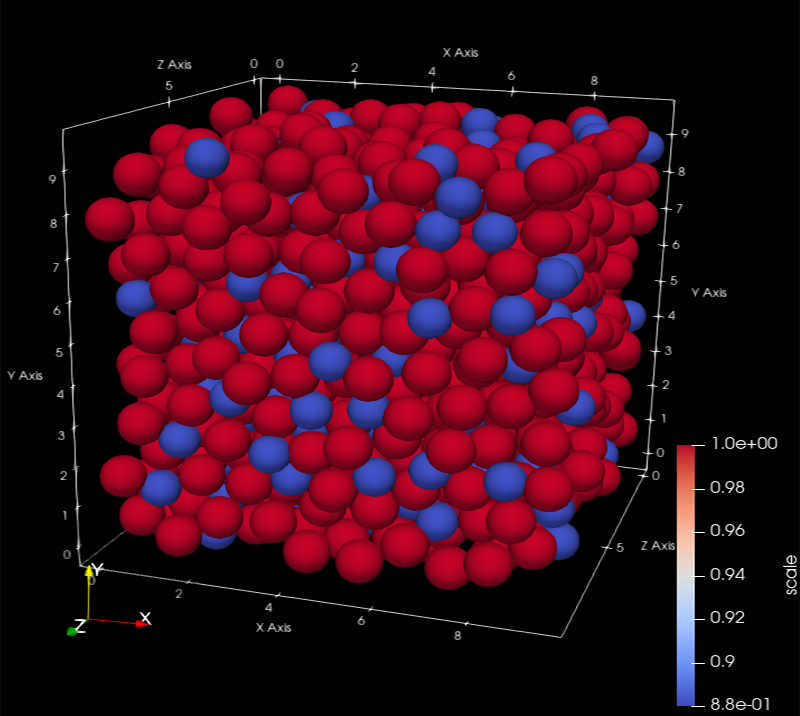
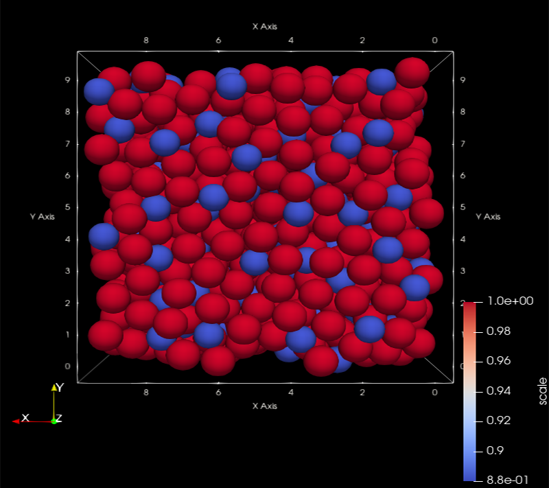
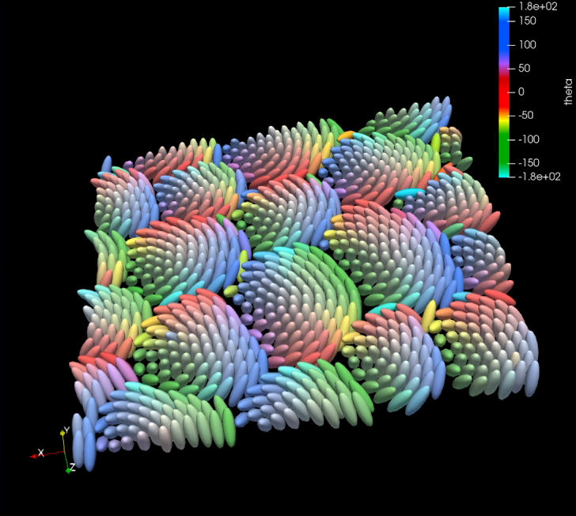
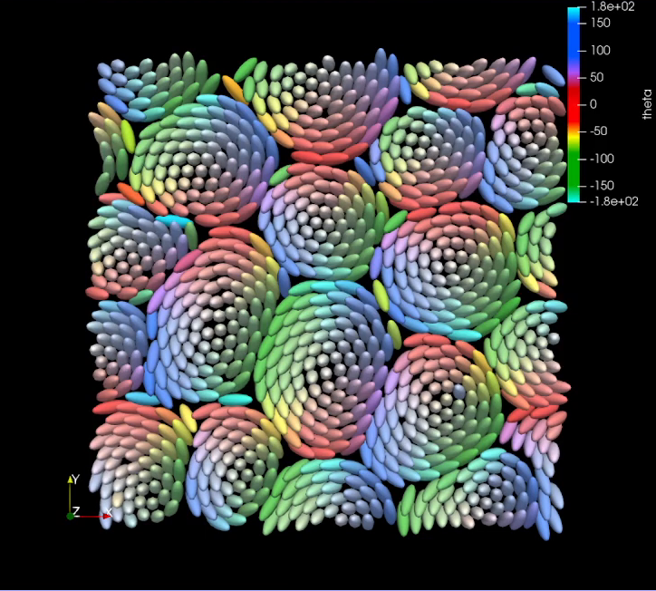

# Overview
One of the goals of the project is to enable researchers to visualize the result of molecular dynamic (MD) simulation easily with ParaView. 

  
  

  
  

## User Manual

### Tutorial Videos (YouTube)

### Detailed Documentations

1. [Adapt your dataset for visualization](user_manual/Adapt_your_dataset_for_visualization.pdf)
2. [Express ellipsoid in vtk format](user_manual/Express_ellipsoid_in_vtk_format.pdf)
3. [Color of particles](user_manual/Color_of_the_particles.pdf)
4. [Extract particles by planes](user_manual/Extract_particles_by_planes.pdf)
5. [ParaView GUI commands](user_manual/Paraview_GUI_commands.pdf)
6. [Resources](user_manual/Resources.pdf)

## Breakdown of directories

`data` - where input data need to be stored

`ParaView_macro` - python macro can be loaded and run in ParaView. Detail on macros is on [this page](user_manual/Paraview_GUI_commands.pdf) 

`utils` - contains helper functions to process dataframe, converting vtk file etc

## Command to run

1. `git clone https://github.com/deepflowinc/md-visualisation.git` 
2. adjust arguments in `run.sh`
### If you want to see the cross section of a system using plane
 `python3 pipeline.py --input_dir <path/to/data/dir/> --input_column_names <variable1 variable2 ... variableN> --cross_section_grad <a b c d> --cross_section_width <w> --cross_section_origin <x0 y0 z0>` where `<>` is a placeholder
### example
 `python3 pipeline.py --input_dir data --input_column_names x y z --cross_section_grad 2 -1 0 1 --cross_section_width 1 --cross_section_origin 0 0 0`  

3. `bash runme.sh` and generate vtk file

4. load macro `visualiseVTK.py` on ParaView # For ellipsoid visualisation, use `visualiseVTK_ellipsoid.py`

5. press button to run `visualiseVTK.py` on ParaView

## Arguments

`input_dir` - path to the directory containing input data

`input_column_names` - header of the data file you are processing.

`input_skip_first_line` - if specified, skips the first line of the input when loading the input file.

`vtk_saved_dir` - path to store output vtk files

`save_csv` - If ‘on’, the program saves the processed dataframes into csv file

`save_video` - If ‘True’, the program creates a .vtk.series file which combines all the vtk files, which can be animated in ParaView

`scale` - Scale determines the radius of particles. This parameter is used unless scale is not specified in dataframe for each particles. Every particle will have the same scale in this way.

`ratio` - Ratio determines the shape of particles. The parameter is the ratio of the long and short axis(long/short), which are the length of the eigenvectors. This parameter is used unless ratio is not specified in dataframe for each particles. Every particle will have the same ratio in this way

**Plane equation:** $a\cdot (x-x_0) + b\cdot (y-y_0) +c\cdot (z-z_0) +d =0$

more detail on [this page](user_manual/Extract_particles_by_planes.pdf)

`cross_section_grad` - parameter a, b, c, d to define the gradient of the plane

`cross_section` - width of 2 planes cutting the 3D particle models. If not defined, it becomes the same as the radius of the particle(scale)

`cross_section` - origin of the plane $x_0, y_0, z_0$, default value is 0, 0, 0

## **packages required**

- numpy
- pandas

## Acknowledgments

This product was originally developed by Yusuke Miyashita as part of his internship in DeepFlow, Inc.
This work is published under BSD-3 license, with approval from Prof. Takeshi Kawasaki at Nagoya University, who was the original contractee of this project.
The original project is supported by JSPS Kakenhi (22H04472) and JST FOREST program (JPMJFR212T).
